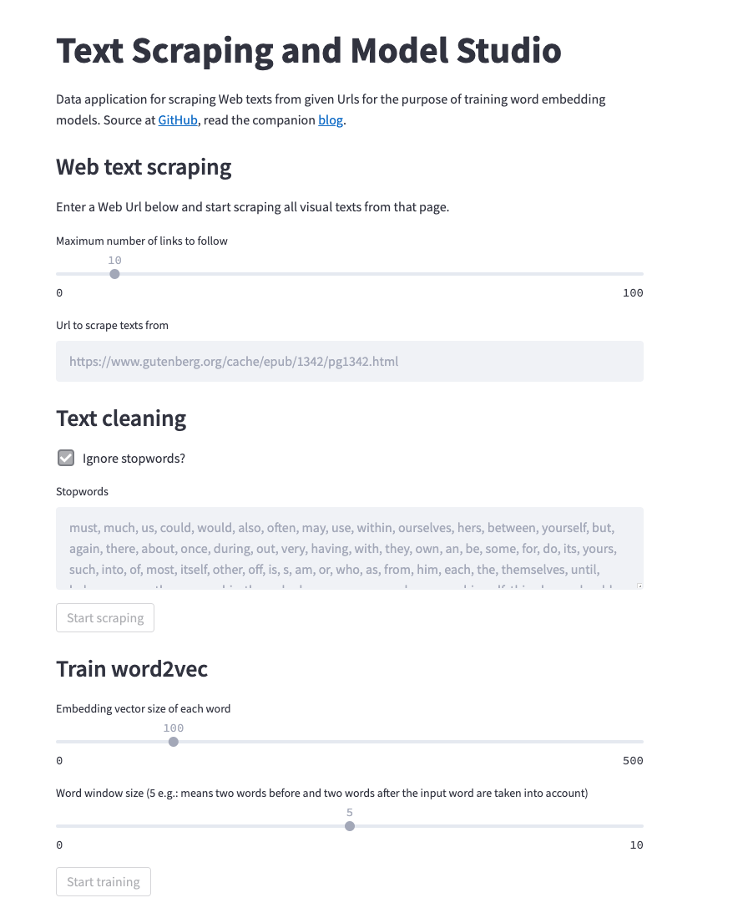

# Web Text Scraping and AI Model Training Studio

A Streamlit data app for scraping texts from urls and training a word2vec model.
Read the companion [blog](https://www.smartlab.at/?p=9128)

## Features

- Automatic scraping of texts from given Web urls
- Extraction of sentences of words
- Cleanup of scraped sentences
- Download scraped and cleaned sentences as JSON file
- Training of word2vec model
- Persists the model and offer as download

## Build the Docker container

docker build --tag text-studio .
docker run -it text-studio /bin/sh
docker run -p 8501:8501 text-studio
